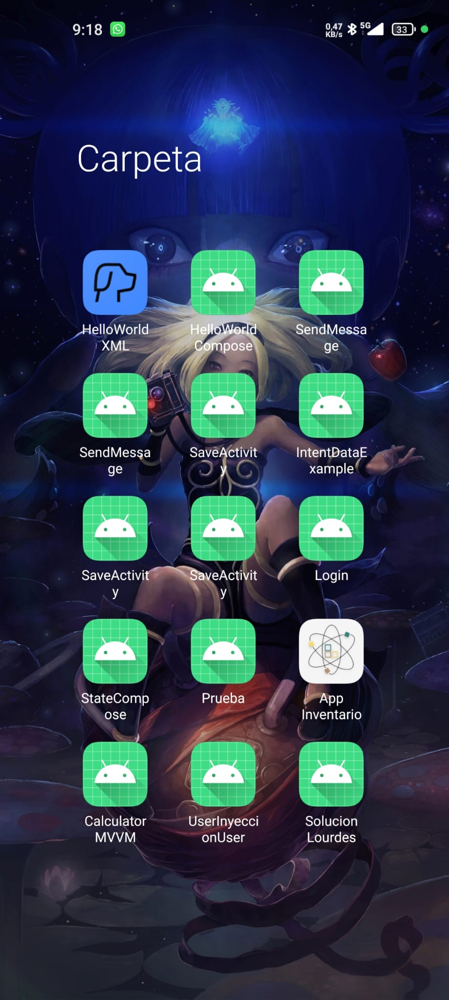
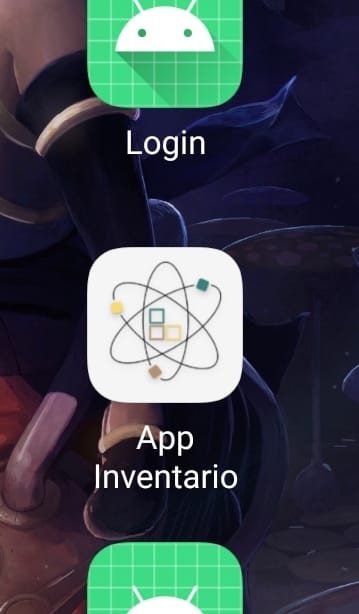

# PROYECTO INVENTORY

# Versions
* [Version 0.3.0](https://github.com/paablomotaa/ProjectInventory-LiseMeitner?tab=readme-ov-file#version-030)
  * [Cambios visuales](https://github.com/paablomotaa/ProjectInventory-LiseMeitner#1-cambios-visuales)
    * [Visualización de los colores en el tema de la aplicación](https://github.com/paablomotaa/ProjectInventory-LiseMeitner#-1-visualizaci%C3%B3n-de-los-colores-en-el-tema-de-la-aplicaci%C3%B3n)
    * [Implementación de MVVM en edit y details](https://github.com/paablomotaa/ProjectInventory-LiseMeitner#-2-implementaci%C3%B3n-de-mvvm-en-edit-y-details)
    * [Implementación de un lottie en pantalla de "No data"](https://github.com/paablomotaa/ProjectInventory-LiseMeitner#-3-implementaci%C3%B3n-de-un-lottie-en-pantalla-de-no-data)
    * [Cambios en los TopAppBar](https://github.com/paablomotaa/ProjectInventory-LiseMeitner#-4-cambios-en-los-topappbar)
    * [Filtrado de los objetos de los modulos](https://github.com/paablomotaa/ProjectInventory-LiseMeitner#-5-filtrado-de-los-objetos-de-los-modulos)
    * [Eliminación de los objetos en los modulos](https://github.com/paablomotaa/ProjectInventory-LiseMeitner#-6-eliminaci%C3%B3n-de-los-objetos-en-los-modulos)
  * [Cambios no visuales](https://github.com/paablomotaa/ProjectInventory-LiseMeitner#2-cambios-no-visuales)
    * [Implementación de hilt](https://github.com/paablomotaa/ProjectInventory-LiseMeitner#-1-implementaci%C3%B3n-de-hilt)
    * [Navegación a las pantallas edit y details](https://github.com/paablomotaa/ProjectInventory-LiseMeitner#-2-navegaci%C3%B3n-a-las-pantallas-edit-y-details)
* [Version 0.2.1](https://github.com/paablomotaa/ProjectInventory-LiseMeitner#version-021)
  * [Implementación del icono de la aplicación](https://github.com/paablomotaa/ProjectInventory-LiseMeitner#1implementaci%C3%B3n-del-icono-de-la-aplicaci%C3%B3n)
* [Version 0.2.0](https://github.com/paablomotaa/ProjectInventory-LiseMeitner?tab=readme-ov-file#version-020)
  * [Navegacion entre pantallas](https://github.com/paablomotaa/ProjectInventory-LiseMeitner?tab=readme-ov-file#1navegacion-entre-pantallas)
  * [Implementación de MVVM en creates y list](https://github.com/paablomotaa/ProjectInventory-LiseMeitner?tab=readme-ov-file#2implementaci%C3%B3n-de-mvvm-en-creates-y-list)
  * [Implementación de repositorios](https://github.com/paablomotaa/ProjectInventory-LiseMeitner?tab=readme-ov-file#3implementaci%C3%B3n-de-repositorios)
* [Version 0.1.0](https://github.com/paablomotaa/ProjectInventory-LiseMeitner?tab=readme-ov-file#version-010)
  * [Proyecto Inventory - Módulo Category 📦](https://github.com/paablomotaa/ProjectInventory-LiseMeitner?tab=readme-ov-file#proyecto-inventory---m%C3%B3dulo-category-)
  * [Proyecto Inventory - Módulo Product 📦](https://github.com/paablomotaa/ProjectInventory-LiseMeitner?tab=readme-ov-file#proyecto-inventory---m%C3%B3dulo-product-)
  * [Proyecto Inventory - Módulo Inventory 📦](https://github.com/paablomotaa/ProjectInventory-LiseMeitner?tab=readme-ov-file#proyecto-inventory---m%C3%B3dulo-inventory-)
  * [Bases](https://github.com/paablomotaa/ProjectInventory-LiseMeitner?tab=readme-ov-file#bases)

---
---
# Version 0.3.0
## 1. Cambios visuales

### -1. Visualización de los colores en el tema de la aplicación

Se a cambiado para que todos los dispositivos se muestre el tema de la aplicación.

---
### -2. Implementación de `MVVM` en `edit` y `details`

Se ha cambiado las variables que tenian remember y se a creado los `view models` para cada vista con su `state` correspondiente.

---
### -3. Implementación de un `lottie` en pantalla de "No data"

Ahora en las listas de cada modulo se ha implementado un `lottie`(una animación) para saver que no hay datos.

---
### -4. Cambios en los `TopAppBar`

Ahora cada TopAppBar es un mismo composable modificable y cada pantalla de lista de los modulos tienen un icono que abre el `drawer`.

---
### -5. `Filtrado` de los objetos de los modulos

En cada pantalla de lista hay un boton de `filtrar` en los TopAppBar funcional.

---
### -6. `Eliminación` de los objetos en los modulos

Implementado la eliminación de los objetos al mantener el dedo en la lista(se abrira un dialog para confirmar) o en el `view` del objeto

---
## 2. Cambios no visuales

### -1. Implementación de hilt

Se a añadido hilt en la aplicación para la `inyección de dependencias`(repositorios y viewmodels) en cada modulo 

---
### -2. Navegación a las pantallas edit y details

Ahora es posible acceder a las pantallas de edit y details de cada objeto de cada modulo pulsando encima del objeto desde la pantalla de lista

---
---
# Version 0.2.1
## 1.Implementación del `icono` de la aplicación

Creditos a [FJVidalG](https://github.com/FJVidalG) y [Azureart](https://www.instagram.com/__azureart__?igsh=MWY1NjJ6b3FraW5yaw==)

---
---
# Version 0.2.0
## 1.`Navegacion` entre pantallas

Se a implementado la navegación entre pantallas con un `drawer` que aparece al tocar el icono de usuario para las pantallas principales (Inventory, Product, Category) y en cada modulo una navegación (del list al create).

---
## 2.Implementación de `MVVM` en `creates` y `list`
Se ha cambiado las variables que tenian remember y se a creado los `view models` para cada vista con su `state` correspondiente.

---
## 3.Implementación de `repositorios`
Se ha implementado los repositorios en cada modulo para poder crear y ver las listas de los productos, listas...

---
---
# Version 0.1.0
# Proyecto Inventory - Módulo Category 📦

La siguiente información corresponde al apartado **Categoría** de la aplicación. Se implementaron las interfaces de creación y edición, lista y consulta de detalles de las mismas.

---

## 📋 Cambios implementados

### 1. **Clase `Category`**
La clase `Category` representa una categoría del inventario.

---

### 2. **Vista: Lista de Categorías (`CategoryList`)**
Esta vista muestra todas las categorías existentes en una lista con desplazamiento vertical (scroll). Los usuarios podrán seleccionar cualquier categoría para ver sus detalles. Además cada elemento de la lista tendrá una imagen propia al tipo de categoría.

---

### 3. **Vista: Crear Categoría (`CategoryCreate`)**
Esta vista permite a los usuarios añadir nuevas categorías al inventario mediante un formulario con campos obligatorios, un menú desplegable, un checkbox, una fecha de creación y un botón Guardar.

---

### 4. **Vista: Editar Categoría (`CategoryEdit`)**
Esta vista permite a los usuarios añadir nuevas categorías al inventario mediante un formulario con campos obligatorios, un menú desplegable , un checkbox, una fecha de creación y un botón Actualizar para guardar los cambios.

---

### 5. **Vista: Detalles de Categoría**
Muestra información detallada de una categoría específica seleccionada en la lista.

---

# Proyecto Inventory - Módulo Product 📦

La siguiente información corresponde al apartado **Producto** de la aplicación. Se implementaron las interfaces de creación y edición, lista y consulta de detalles de las mismas.

---

### 1. **Clase `Producto`**
La clase `Producto` representa un producto del inventario. 

---

### 2. **Vista: Lista de Productos (`ProductList`)**
Esta vista muestra todas los productos existentes en una lista con desplazamiento vertical (scroll). Los usuarios podrán seleccionar cualquier categoría para ver sus detalles. Además cada elemento de la lista tendrá una imagen propia al tipo de productos con un AppBar con el titulo siendo el nombre del inventario, tres _ActionButton_ uno para ver la cuenta, otro para filtrar los productos y otro para buscar un producto, y un _FloatingButton_ para poder añadir un nuevo producto.

---

### 3. **Vista: Crear Producto (`ProductCreate`)**
Añade un AppBar con el titulo _Crear producto_. Tambien contiene un Card donde esta todas las propiedades necesarias de producto, todas añadidas como _TextField_, algunas estan añadidas como _DropdownMenu_ y las fechas como _DateField_, ademas de un _Button_ para crear el producto.

---

### 4. **Vista: Editar Producto (`ProductEdit`)**
Añade un AppBar con el titulo _Editar producto_. implementa lo mismo que **Crear producto** pero _Code_ no se puede editar por que es un _TextField_ de solo lectura.

---

### 5. **Vista: Detalles de Producto**
Añade un AppBar con el titulo siendo el nombre del producto y un _ActionButton_ para poder editar. Añade lo mismo que **Crear producto** pero todos son _TextField_ de solo lectura.

---

# Proyecto Inventory - Módulo Inventory 📦

### 1. **Clase `Inventario`**
La clase `Inventory` representa el inventario o inventarios de nuestra aplicación.

---

### 2. **Vista: Lista de Inventarios(`InventoryList`)**

Esta vista se muestran todos los inventarios que podremos tener en nuestra aplicación. Los usuarios podrán acceder al listado de los productos registrados pulsando sobre cada una de ella. Además podremos personalizar la imagen por una personalizada.

---

### 3. **Vista: Crear Inventario(`InventoryCreate`)**

Desde esta vista los usuarios podrán crear sus inventarios mediante el formulario propuesto. En el mismo se piden los datos más relevantes del inventario utilizando campos obligatorios, menú desplegable y un botón para guardar los cambios.

---

### 4. **Vista: Editar Inventario(`InventoryEdit`)**

Desde esta vista, los usuarios podrán editar los inventarios ya existentes de nuestra aplicación. En esta podremos cambiar cada uno de los datos de nuestro inventario exceptuando el código que será de solo lectura. Se basa en InventoryCreate

---

### 5. **Vista: Detalles de Inventario**

En esta vista, los usuarios podrán ver las propiedades del inventario. Con unos campos de solo lectura.

---

## BASES

### BASECARDS

-Tiene el composable **CardRow** que crea una tarjeta con un _Row_ para mostrar el contenido de forma horizontal

---

### BASEDATE

-Tiene el composable **DateField** que crea una _TextField_ de solo lectura que activa un **dialog**

-Tiene el composable **DialogDate** que crea una _Dialog_ que muestra un **DatePicker**

---

### BaseDropdownMenu

-Tiene el composable **BaseDropdownMenu** que crea una _TextField_ de solo lectura que al clickar muestra _DropdownMenuItem_ con opciones dadas a través de una lista.

---

### BaseImage

-Tiene el composable **BaseImageBig** que crea una _Image_ con un tamaño grande y con forma redonda.

-Tiene el composable **BaseImageMedium** que crea una _Image_ con un tamaño mediana y con forma redonda.

-Tiene el composable **BaseImageSmall** que crea una _Image_ con un tamaño pequeña y con forma redonda.

---

### BaseStructure

-Tiene el composable **BaseStructureCompletePadding** que crea un _Column_ dentro de un _Box_ con padding en todas las direcciones.

-Tiene el composable **BaseStructureCompletePaddingUpSide** que crea un _Column_ dentro de un _Box_ con padding en arriba y a los lados.

-Tiene el composable **BaseStructureCompBaseStructureCompletePaddingUpSideletePadding** que crea un _Column_ con padding en arriba y a los lados.

-Tiene el composable **BaseStructureCollumnPadding** que crea un _Column_ con padding en todas las direcciones.

-Tiene el composable **BaseRow** que crea un _Row_ con padding en todas las direcciones.

---

### BaseText

-Tiene el composable **BaseText** que crea un _Text_ simple.

---

### BaseTextField

-Tiene el composable **BaseTextField** que crea un _TextField_ de una sola linea.

-Tiene el composable **BaseTextFieldRead** que crea un _TextField_ de una sola linea de solo lectura.

---

### TopAppBar

-Tiene el composable **TopAppBarTitle** que crea un _Scaffold_ con un **topBar** y un **navigationIcon** para volver atras.

-Tiene el composable **TopAppBarFloating** que crea un _Scaffold_ con un **topBar**, un **navigationIcon** para volver atras y un **floatingButton**.

-Tiene el composable **TopAppBarOneAction** que crea un _Scaffold_ con un **topBar**, un **navigationIcon** para volver atras y un **actionButton**.

-Tiene el composable **TopAppBarComplete** que crea un _Scaffold_ con un **topBar**, un **navigationIcon** para volver atras, un **floatingButton** y tres **actionButton**.

---

### TextComposable

-Tiene el composable **TitleText** que crea un _Text_ de tipo título.
-Tiene el composable *MediumTitleText** que crea un _Text_ de tipo subtítulo.
-Tiene el composable **ErrorTextInputField** que crea un _Text_ de tipo Error para los TextField.

---

### ButtonComposable

-Tiene el composable **NormalButton** para hacer botones normalizados para la aplicación.

---

## 📚 Tecnologías Utilizadas

- **Lenguaje:** Kotlin

---

## 📄 Notas Adicionales

---

## Licencia
